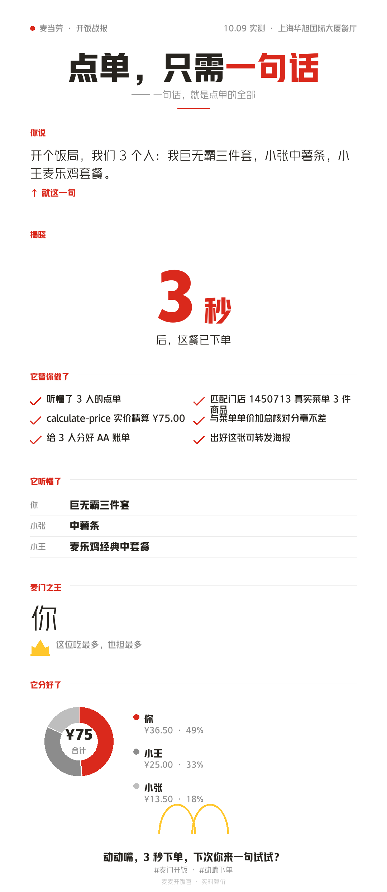

<p align="center"></p>

# 麦麦开饭官 · McD Meal Butler（Skill 版）

> 把一群人点麦当劳，从「刷屏乱聊」变成「一句话搞定」：多人各自点单，自动汇总成单、算出最省方案、生成分账和一张能晒的开饭海报。
> 本版本是 **WorkBuddy Skill** 形态 —— 无需部署服务器，Agent 直接编排麦当劳 MCP 完成全流程。

[](https://github.com/M-China/mcd-mcp-server)
[]()
[]()
[]()

<p align="center">
  
</p>

---

## 🍟 一句话看懂

跟 Agent 说一句「开个饭局，我们 8 个人，我点巨无霸不要酸瓜、他要麦辣换无糖可乐、再整 5 块麦乐鸡」，
Agent 自动完成：

1. **解析** — 把每个人的大白话点单结构化成清单（谁、点了啥、几份、什么规格）
2. **拉菜单** — 调麦当劳 MCP `query-meals` 匹配真实商品
3. **精算最省** — 构造「纯券 / 积分兑换 / 组合」三套方案，**逐套调 `calculate-price` 取实价**，选最省
4. **AA 分账** — 按各人餐品占比自动摊平，金额守恒
5. **开饭海报** — 生成一张可保存转发的战报图（含"本群麦当劳之王"彩蛋）
6. **一键下单** — 需要时给出 MCP 支付链接

---

## 😩 它解决什么问题

拼单点麦当劳，痛点就在这几处：

- 群里消息刷屏，**谁点了什么、点了几份，全靠人工统计**
- 有人忌口、有人要换饮品，**规格记不住**
- 手里的**优惠券 / 积分 / 积分商城**怎么组合最便宜，**没人算得清**
- 点完还要**人工 AA 分账**，又慢又容易算错

**麦麦开饭官**把这四件事一次做完，落点是一张愿意让人转发分享的**开饭海报**。

## 🎯 目标用户

- 办公室下午茶、部门聚餐的**拼单组织者**
- 朋友聚会、宿舍、开黑群的**点单搭子**
- 攒着一堆**麦当劳优惠券和积分、却不知道怎么用最划算**的人

## 🧩 为什么是 Skill 形态，而不是"常驻服务器"

早期版本做成了 FastAPI + 网页 + 二维码分享的 Web 应用。但参赛项目要能被 clone 即用，
部署一台常驻服务器门槛太高；而且 **Agent 本身就是 LLM**，天然能把大白话点单解析成结构化订单，
不需要再配 LLM API。麦当劳 MCP 通过 WorkBuddy 连接器直接调用，无需自写客户端。

于是重构为 **WorkBuddy Skill**：一份 `SKILL.md` 指令 + 一个独立海报脚本，**零服务器、零依赖**（除 Pillow）。

---

## ✨ 核心功能

| 能力 | 说明 |
|---|---|
| 🗣️ **大白话点单** | 随口说"板烧不要生菜""可乐换无糖"，Agent 解析成结构化订单 |
| 🧮 **最优价精算** | 自动构造多套方案（纯券 / 积分兑换 / 组合），以 MCP 实价为准选最省 |
| 👥 **一键 AA 分账** | 按各人餐品金额占比，把优惠公平分摊到每个人 |
| 🖼️ **开饭海报** | 9:16 竖版战报图，全中文、环形饼图分账、含"本群麦当劳之王"，可直接发朋友圈/小红书 |
| 🔗 **一键下单** | 用户确认后输出 MCP 返回的支付链接 |

---

## 🚀 快速开始

### 前置：配置麦当劳 MCP 连接器

1. 到 <https://open.mcd.cn/mcp> 手机号登录 → 控制台 → 激活 → 复制你的 MCP Token。
2. 在 WorkBuddy【连接器】里配置 `mcd-mcp`（Streamable HTTP），把 [`mcp-config.example.json`](mcp-config.example.json)
   中的 `${MCD_MCP_TOKEN}` 替换为真实 Token 并启用。

### 使用

直接把 Skill 放进你的 `~/.workbuddy/skills/`（用户级）或项目 `.workbuddy/skills/`（项目级），
然后跟 Agent 说：

> "开个饭局，我们 5 个人：我巨无霸不要酸瓜，小李麦辣鸡腿堡可乐换无糖，小张两份薯条一杯可乐，老张开心乐园餐，小王麦旋风。"

Agent 会走完 解析 → 精算 → 分账 → 海报 → （可选）下单 全流程，最终给出四块内容：
**本单明细 / 最优方案 / AA 分账 / 开饭海报**。

### 离线演示（无 Token）

仓库提供 Mock 数据样例（见 `examples/mock_mcp_data.json` 思路），
无 MCP 时 Agent 会用 Mock 跑通"精算 + 分账 + 海报"链路做演示，并明确标注"离线 Mock，价格非实时"。

### 生成海报（单独跑脚本）

```bash
pip install Pillow
echo '{
  "group_name":"10.10 开饭 · 3人局",
  "user_quote":"开个饭局，我们 3 个人：我巨无霸不要酸瓜，小李麦辣鸡腿堡可乐换无糖，小张两份薯条一杯可乐。",
  "ai_did":["听懂了每人的口味定制","拉取了门店可售菜单","实时算出精确总价","给 3 人分好 AA 账单","出好这张可转发海报"],
  "items":[{"speaker":"你","name":"巨无霸","spec":"不要酸瓜","qty":1},
           {"speaker":"小李","name":"麦辣鸡腿堡","spec":"可乐换无糖","qty":1},
           {"speaker":"小张","name":"中薯条","spec":"","qty":2}],
  "best":{"code":"A","label":"纯现金","payable":84.0,"original":84.0,"savings":0.0,"points":0},
  "share":[{"speaker":"小李","amount":34.0},{"speaker":"你","amount":27.0},{"speaker":"小张","amount":23.0}]
}' | python scripts/poster.py
# 生成 ./poster.png（9:16 竖版，适合朋友圈/小红书）
```

**海报设计（v7）**：全中文紧凑竖版，叙事主线「点单，只需一句话 → 3 秒搞定」，含本单明细、麦门之王、环形饼图分账。突出**方便快捷好玩**，不主打价格。

**字体无需自备**：脚本三级兜底（汉仪雅酷黑 → macOS 冬青黑体 → 华文黑体 → Noto → PIL 默认），任何机器 clone 即跑。装了汉仪雅酷黑视觉最佳，可用 `MCD_FONT_*` 环境变量指定。

---

## 🔧 用到的麦当劳 MCP 工具

| 阶段 | 工具 |
|---|---|
| 门店与菜单 | `query-nearby-stores`、`delivery-query-stores`、`query-meals`、`query-meal-detail` |
| 券与积分 | `query-my-coupons`、`query-store-coupons`、`auto-bind-coupons`、`query-my-account`、`mall-points-products`、`mall-product-detail` |
| 精算与下单 | `calculate-price`、`create-order` |
| 活动 | `campaign-calendar` |

完整调用链路与业务价值见 [MCP_INTEGRATION.md](MCP_INTEGRATION.md)。

> ✅ **真实接口实测**（2026-10-09，上海黄浦华旭国际大厦餐厅）：菜单 12 分类 64 商品 →
> `calculate-price` 报价 ¥75.00 与菜单单价加总分毫不差，AA 分账 36.5+25.0+13.5 守恒。
> 全链路（门店→菜单→精算→券/积分→海报）均以真实 Token 验证通过。

---

## 📁 目录结构

```
mcd-meal-butler-skill/
├── SKILL.md                # ★ Skill 核心指令（Agent 读它执行全流程）
├── scripts/poster.py       # 独立海报生成脚本（PIL，可单独跑）
├── assets/logo/logo.png    # 项目 Logo
├── README.md
├── MCP_INTEGRATION.md
├── CONTEST_DECLARATION.md  # 官方参赛声明（内容不可改动）
├── mcp-config.example.json # 脱敏 MCP 配置（环境变量占位）
├── workbuddy.md            # WorkBuddy 开发上下文（联动奖励用）
├── LICENSE
└── .gitignore
```

---

## ⚠️ 免责声明

- 本项目为「2026 麦当劳程序员创意开发大赛」参赛作品，**非麦当劳官方产品**。
- 所有餐品信息、价格、库存与供应状态，**以麦当劳官方 MCP 服务返回的实时结果为准**。
- 项目输出仅供参考，不构成营养、健康或其他专业建议。
- MCP Token 等凭据仅通过环境变量注入，**绝不硬编码、绝不提交**。

## 📄 License

个人非商业用途免费使用，详见 [LICENSE](LICENSE) 与 [CONTEST_DECLARATION.md](CONTEST_DECLARATION.md)。
